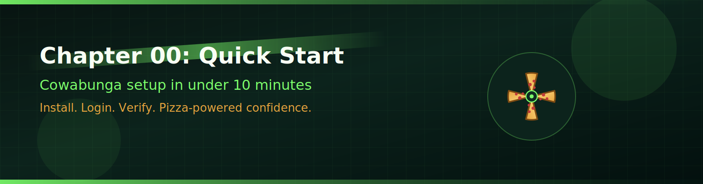
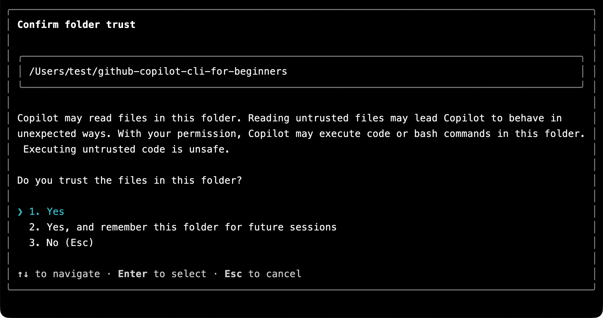
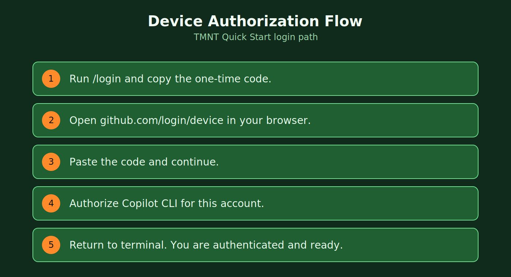
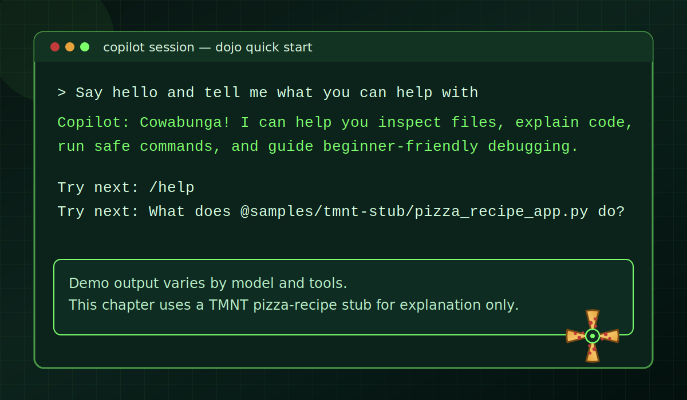

<!--
---
id: CopilotCLI-00
title: !translate Quick Start
description: !translate Install GitHub Copilot CLI, sign in with your GitHub account, and verify that everything works.
audience: Developers / Students / Terminal users
slug: quick-start
weight: 1
---
-->



Welcome! In this chapter, you'll get GitHub Copilot CLI (Command Line Interface) installed, signed in with your GitHub account, and verified that everything works. This is a quick setup chapter. Once you're up and running, the real demos start in Chapter 01!

## 🎯 Learning Objectives

By the end of this chapter, you'll have:

- Installed GitHub Copilot CLI
- Signed in with your GitHub account
- Verified it works with a simple test

> ⏱️ **Estimated Time**: ~10 minutes (5 min reading + 5 min hands-on)

---

## ✅ Prerequisites

- **GitHub Account** with Copilot access. [See subscription options](https://github.com/features/copilot/plans). Students/Teachers can access Copilot Pro for [free via GitHub Education](https://education.github.com/pack).
- **Terminal basics**: Comfortable running simple shell commands like `cd` and `ls` (a shell is the text-based command prompt in your terminal)

### What "Copilot Access" Means

GitHub Copilot CLI requires an active Copilot subscription. You can check your status at [github.com/settings/copilot](https://github.com/settings/copilot). You should see one of:

- **Copilot Individual** - Personal subscription
- **Copilot Business** - Through your organization
- **Copilot Enterprise** - Through your enterprise
- **GitHub Education** - Free for verified students/teachers

If you see "You don't have access to GitHub Copilot," you'll need to use the free option, subscribe to a plan, or join an organization that provides access.

---

## Installation

> ⏱️ **Time estimate**: Installation takes 2-5 minutes. Authentication adds another 1-2 minutes.

### GitHub Codespaces (Zero Setup)

If you don't want to install prerequisites locally, you can use GitHub Codespaces. It has GitHub Copilot CLI ready to go (you'll still need to sign in), plus Python and pytest pre-installed for later chapters.

1. [Fork this repository](https://github.com/breconno/cowabunga/fork) to your GitHub account
2. Select **Code** > **Codespaces** > **Create codespace on main**
3. Wait a few minutes for the container to build
4. You're ready to go! The terminal will open automatically in the Codespace environment.

> 💡 **Verify in Codespace**: Run `copilot` to confirm the CLI opens correctly in your Codespace terminal.

### Local Installation

Follow these steps if you'd like to run Copilot CLI on your local machine with the course samples.

1. Clone the repo to get the course samples on your machine:

    ```bash
    git clone https://github.com/breconno/cowabunga
    cd cowabunga
    ```

2. Install Copilot CLI using one of the following options.

    > 💡 **Not sure which to pick?** Use `npm` if you have Node.js installed. Otherwise, choose the option that matches your system.

    ### All Platforms (npm)

    ```bash
    # If you have Node.js installed, this is a quick way to get the CLI
    npm install -g @github/copilot
    ```

    ### macOS/Linux (Homebrew)

    ```bash
    brew install copilot-cli
    ```

    ### Windows (WinGet)

    ```bash
    winget install GitHub.Copilot
    ```

    ### macOS/Linux (Install Script)

    ```bash
    curl -fsSL https://gh.io/copilot-install | bash
    ```

<details>
<summary>Optional: Enable shell tab completion</summary>

Shell tab completion lets you press **Tab** to complete `copilot` subcommands, command options, and some option values. This is optional, but it can be handy once you're comfortable using the CLI.

Copilot CLI currently supports completion scripts for Bash, Zsh, and Fish:

```shell
# Bash, current session only
source <(copilot completion bash)

# Bash, persistent on Linux
copilot completion bash | sudo tee /etc/bash_completion.d/copilot

# Zsh
copilot completion zsh > "${fpath[1]}/_copilot"

# Fish
copilot completion fish > ~/.config/fish/completions/copilot.fish
```

Restart your shell after adding persistent completion. PowerShell is supported for running Copilot CLI on Windows, but `copilot completion` currently supports only Bash, Zsh, and Fish.

</details>

---

## Authentication

Open a terminal window at the root of the `cowabunga` repository, start the CLI and allow access to the folder.

```bash
copilot
```

You'll be asked to trust the folder containing the repository (if you haven't already). You can trust it one time or across all future sessions.



After trusting the folder, you can sign in with your GitHub account.

```
> /login
```

**What happens next:**

1. Copilot CLI displays a one-time code (like `ABCD-1234`)
2. Your browser opens to GitHub's device authorization page. Sign in to GitHub if you haven't already.
3. Enter the code when prompted
4. Select "Authorize" to grant GitHub Copilot CLI access
5. Return to your terminal - you're now signed in!



*The device authorization flow: your terminal generates a code, you verify it in the browser, and Copilot CLI is authenticated.*

**Tip**: The sign-in persists across sessions. You only need to do this once unless your token expires or you explicitly sign out.

---

## Verify It Works

### Step 1: Test Copilot CLI

Now that you're signed in, let's verify that Copilot CLI is working for you. If you're not already in the Copilot CLI session, run `copilot` first, then enter:

```bash
> Say hello and tell me what you can help with
```

After you receive a response, you can exit the CLI:

```bash
> /exit
```

---

<details>
<summary>🎬 See it in action!</summary>



*Demo output varies. Your model, tools, and responses will differ from what's shown here.*

</details>

---

**Expected output**: A friendly response listing Copilot CLI's capabilities.

### Step 2: Bash Fundamentals for Agentic Operations

Before working with the Python sample app, build a quick Bash foundation so the next chapters feel easier.

Bash is a shell (a text interface where you run commands). Agentic operations means using Copilot CLI to help inspect, edit, and validate files from the terminal.

Run these commands from the repository root:

```bash
# Show where you are
pwd

# List files and folders in the current location
ls

# List files with extra details (permissions, size, modified time)
ls -la

# Move into Chapter 00 and list what is there
cd 00-quick-start
ls

# Return to the repository root
cd ..
```

Now do the same workflow with Copilot CLI prompts (one prompt per command):

```text
copilot
> What workspace and path I am currently in?

> Explain what each top-level folder is for in this repo.

> Run `ls -la` and explain what the extra columns and hidden entries mean.

> Move into `00-quick-start` then summarize what files are there.

> Go back to the repository root with and confirm where we are now.
```

**Expected output**: You can move around the repo, recognize chapter folders, and return to the root without getting lost.

#### Git Fundamentals for Safe AI-Assisted Workflows

Git is a version control system (it tracks file changes over time). These commands help you check what changed before accepting or keeping AI-generated edits.

```bash
# See changed files
git status

# Stage one file (put it in the staging area, the "ready to commit" list)
git add 00-quick-start/README.md

# Review exactly what is staged
git diff --staged

# Save staged changes with a message
git commit -m "docs: update chapter 00 bash-first onboarding"

# Show recent commits in one-line format
git log --oneline
```

Now do the same Git workflow with Copilot CLI prompts (one prompt per command):

```text
copilot
> Explain which files are modified, staged, or untracked.

> Add 00-quick-start/README.md, then run `git status` and explain what changed.

> Run `git diff --staged` and summarize exactly what is staged.

> Run `git commit -m "docs: update chapter 00 bash-first onboarding"` and explain the commit result.

> Run `git log --oneline -n 5` and explain what each part of each line means.
```

**Safety tip**: Read `git diff --staged` before every commit so you verify exactly what will be recorded.

> **Note:** This Quick Start chapter uses a temporary TMNT Python stub at `samples/tmnt-stub/pizza_recipe_app.py` for explanation practice. You are not running the app in this step.

### Step 3: Try Copilot CLI with a Temporary TMNT Stub

Make sure you're at the repository root first:

```bash
# Works from any subfolder inside this repository
cd "$(git rev-parse --show-toplevel)"
copilot
> What does @samples/tmnt-stub/pizza_recipe_app.py do?
```

**Expected output**: A short explanation of the TMNT-themed placeholder file and its simple helper functions.

This step uses a temporary stub file while the full TMNT sample app is still being built.
It keeps this quick-start exercise simple and focused on learning how to ask Copilot CLI to explain code.
You are not running the Python app yet.

If you see an error, check the [troubleshooting section](#troubleshooting) below.

Once you're done you can exit the Copilot CLI:

```bash
> /exit
```

---

## ✅ You're Ready!

That's it for installation. The real fun starts in Chapter 01, where you'll:

- Watch AI review the book app and find code quality issues instantly
- Learn three different ways to use Copilot CLI
- Generate working code from plain English

**[Continue to Chapter 01: First Steps →](../01-setup-and-first-steps/README.md)**

---

## Troubleshooting

### "copilot: command not found"

The CLI isn't installed. Try a different installation method:

```bash
# If brew failed, try npm:
npm install -g @github/copilot

# Or the install script:
curl -fsSL https://gh.io/copilot-install | bash
```

### "You don't have access to GitHub Copilot"

1. Verify you have a Copilot subscription at [github.com/settings/copilot](https://github.com/settings/copilot)
2. Check that your organization permits CLI access if using a work account

### "Authentication failed"

Re-authenticate:

```bash
copilot
> /login
```

### Browser doesn't open automatically

Manually visit [github.com/login/device](https://github.com/login/device) and enter the code shown in your terminal.

### Token expired

Simply run `/login` again:

```bash
copilot
> /login
```

### Still stuck?

- Check the [GitHub Copilot CLI documentation](https://docs.github.com/copilot/concepts/agents/about-copilot-cli)
- Search [GitHub Issues](https://github.com/github/copilot-cli/issues)

---

## 🔑 Key Takeaways

1. **A GitHub Codespace is a quick way to get started** - GitHub Copilot CLI is ready quickly, and Python/pytest are pre-installed for later exercises
2. **Multiple installation methods** - Choose what works for your system (Homebrew, WinGet, npm, or install script)
3. **One-time authentication** - Login persists until token expires
4. **Bash + Git basics first** - You'll use navigation, status, diff, and commit checks constantly when collaborating with Copilot CLI

> 📚 **Official Documentation**: [Install Copilot CLI](https://docs.github.com/copilot/how-tos/copilot-cli/cli-getting-started) for installation options and requirements.

> 📋 **Quick Reference**: See the [GitHub Copilot CLI command reference](https://docs.github.com/en/copilot/reference/cli-command-reference) for a complete list of commands and shortcuts.

---

**[Continue to Chapter 01: First Steps →](../01-setup-and-first-steps/README.md)**
