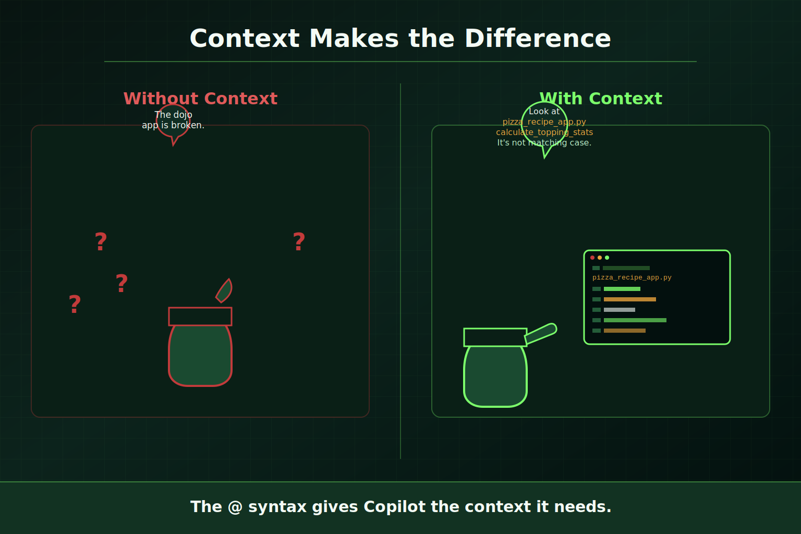
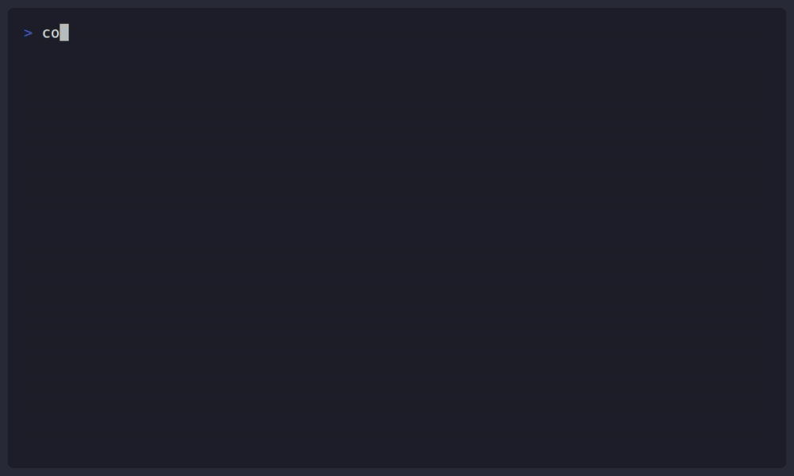
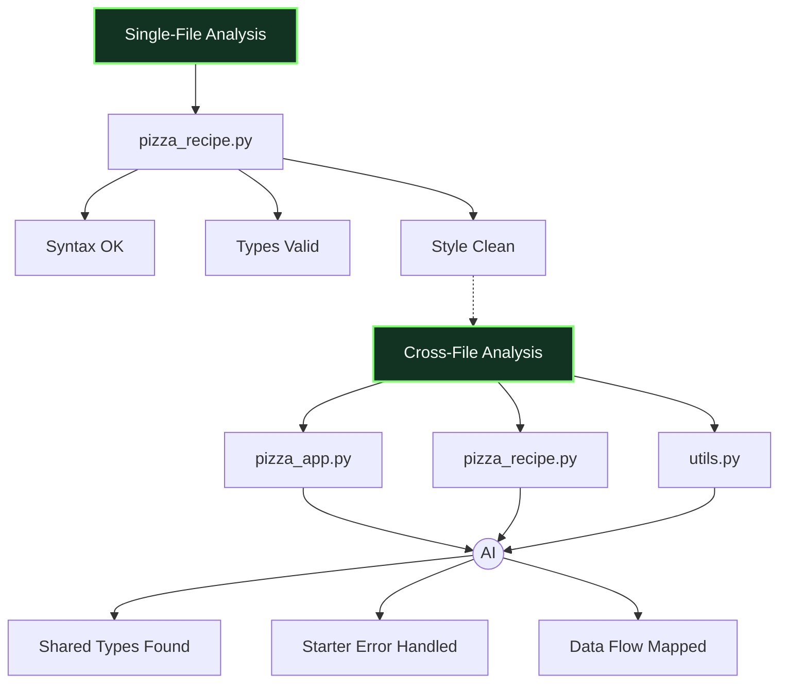
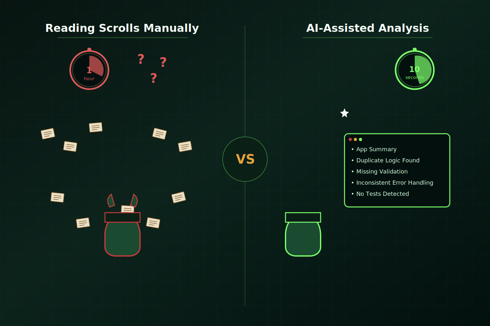
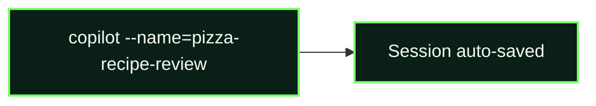
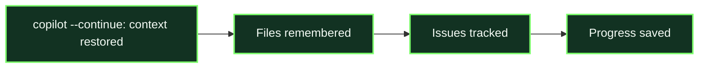
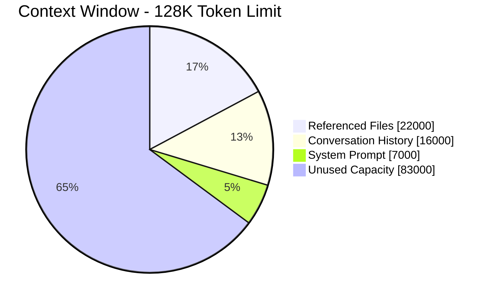

<!--
---
id: CopilotCLI-02
title: !translate Context and Conversations
description: !translate Use file and directory context, resume previous sessions, and write effective multi-turn conversations with GitHub Copilot CLI.
audience: Developers / Students / Terminal users
slug: context-and-conversations
weight: 3
---
-->


> **What if AI could see your entire codebase, not just one file at a time?**

In this chapter, you'll unlock the real power of GitHub Copilot CLI: context. You'll learn to use the `@` syntax to reference files and directories, giving Copilot CLI deep understanding of your codebase. You'll discover how to maintain conversations across sessions, resume work days later exactly where you left off, and see how cross-file analysis catches bugs that single-file reviews miss entirely.

## 🎯 Learning Objectives

By the end of this chapter, you'll be able to:

- Use the `@` syntax to reference files, directories, and images
- Resume previous sessions with `--resume` and `--continue`
- Understand how [context windows](../GLOSSARY.md#context-window) work
- Write effective multi-turn conversations
- Manage directory permissions for multi-project workflows

> ⏱️ **Estimated Time**: ~50 minutes (20 min reading + 30 min hands-on)

---

## 🧩 Real-World Analogy: Working with a Colleague



*Just like your colleagues, Copilot CLI isn't a mind reader. Providing more information helps humans and Copilot alike provide targeted support!*

Imagine explaining a bug to a colleague:

> **Without context**: "Dude. The pizza app's broke [sad face emoji]"

> **With context**: "Look at `@samples/pizza-recipe-project/pizza_recipe.py`, especially `list_recipes()`. Is its `NotImplementedError` an accidental bug or an intentional lesson scaffold?"

To provide context to Copilot CLI use *the `@` syntax* to point Copilot CLI at specific files.

---

### 🥷 Essential: Basic Context

<div align="left">


<sub>Before you spar with Copilot</sub>

</div>

> [!IMPORTANT]
> This part is required. Skip it and your prompts land like a shuriken
> thrown with your eyes closed.
>
> **Only what's in the light counts.** `@file` references, open tabs, and
> anything you explicitly mention are what Copilot can actually see.
> Everything else is outside the dojo walls — Copilot can't read your mind,
> only your context.

**Master the basics first**.

This lesson covers everything you need to work effectively with context. 

---

## The @ Syntax

The `@` symbol references files and directories in your prompts. It's how you tell Copilot CLI "look at this file."

> 💡 **Note**: All examples in this course use the `samples/` folder included in this repository, so you can try every command directly.

### Try It Now (No Setup Required)

You can try this with any file on your computer:

```bash
copilot

# Point at any file you have
> Explain what @package.json does
> Summarize @README.md
> What's in @.gitignore and why?
```

> 💡 **Don't have a project handy?** Create a quick test file:
> ```bash
> echo "def greet(name): return 'Cowabunga ' + name" > cowabunga.py
> copilot
> > What does @cowabunga.py do?
> ```

### Basic @ Patterns

| Pattern | What It Does | Example Use |
|---------|--------------|-------------|
| `@file.py` | Reference a single file | `Review @samples/pizza-recipe-project/pizza_recipe.py` |
| `@folder/` | Reference all files in a directory | `Review @samples/pizza-recipe-project/` |
| `@file1.py @file2.py` | Reference multiple files | `Compare @samples/pizza-recipe-project/pizza_recipe.py with @samples/python-app-template.py` |

### Reference a Single File

```bash
copilot

> Explain what @samples/pizza-recipe-project/utils.py does? Summarize briefly.
```

---

<details>
<summary>🎬 See it in action!</summary>



*Demo output varies. Your model, tools, and responses will differ from what's shown here.*

</details>

---

### Reference Multiple Files

Compare the pizza recipe starter with a generic Python app template to see how
two file references give Copilot CLI a clear basis for review. From the
repository root, start Copilot CLI and enter this prompt:

```bash
copilot

> Compare @samples/pizza-recipe-project/pizza_recipe.py with @samples/python-app-template.py. List the differences in structure, type hints, docstrings, and function behavior. Explain each difference in beginner-friendly language, but do not change either file.
```

The first file is the TMNT starter you will build on in later lessons.
`python-app-template.py` is a generic, completed reference—not another pizza
solution—so Copilot CLI can identify useful differences without comparing the
starter to itself. Two files, one focused prompt: now you're giving it
ninja-level context.

### Reference an Entire Directory

```bash
copilot

> Review all files in @samples/pizza-recipe-project/ for error handling
```

---

## Cross-File Intelligence

This is where context becomes a superpower. Single-file analysis is useful. Cross-file analysis is transformative.



---

### Demo: Trace a Feature Across Multiple Files

```bash
copilot

> @samples/pizza-recipe-project/pizza_app.py @samples/pizza-recipe-project/pizza_recipe.py @samples/pizza-recipe-project/utils.py
>
> How do these files work together? Trace the current call from pizza_app.py into pizza_recipe.py, explain why no recipe data reaches utils.py yet, and describe the future display flow after list_recipes() is implemented. Do not implement the TODOs.
```

> 💡 **Advanced Option**: For security-focused cross-file analysis, try the Python security examples:
> ```bash
> > @samples/buggy-code/python/user_service.py @samples/buggy-code/python/payment_processor.py
> > Find security vulnerabilities that span BOTH files
> ```

---

<details>
<summary>🎬 See it in action!</summary>


*Demo output varies. Your model, tools, and responses will differ from what's shown here.*

</details>

---

**What Copilot CLI discovers**:

```
Cross-Module Analysis
=====================

1. APP ORCHESTRATION
   pizza_app.py calls list_recipes() from pizza_recipe.py
   Today, it catches the intentional NotImplementedError
   After list_recipes() is completed, it will pass recipes to utils.py

2. SHARED RECIPE TYPE
   pizza_recipe.py defines the PizzaRecipe data class
   utils.py imports PizzaRecipe for its print_recipes() type hint

3. FUTURE DATA FLOW
   pizza_app.py → pizza_recipe.list_recipes() → recipe values
   recipe values → utils.print_recipes() → terminal output

4. INTENTIONAL STARTER GAP
   list_recipes() raises NotImplementedError because learners complete it later
   pizza_app.py catches that specific error and prints a clear status message
   instead of crashing or filling in the lesson's TODOs

   Current output:
   Pizza recipes are not ready yet: Complete list_recipes() in a future lesson.
```

**Why this matters**: A single-file review would miss the bigger picture. Only cross-file analysis reveals:
- **Entry-point behavior** that coordinates the recipe and display modules
- **Shared types** that connect modules
- **Data flow patterns** showing how values move between functions
- **Error handling** that keeps an intentional starter gap visible and safe

---

### Demo: Understand a Codebase in 60 Seconds



New to a project? Learn about it quickly using Copilot CLI.

```bash
copilot

> @samples/pizza-recipe-project/
>
> In one paragraph, what does this app do? Describe its module boundaries and distinguish intentional starter gaps from bugs.
```

**What you get**:
```
This is a starter TMNT pizza recipe app split into three modules. pizza_app.py
is the entry point, pizza_recipe.py defines the PizzaRecipe type and future
recipe operations, and utils.py contains terminal input and display helpers.
The empty recipe collection and NotImplementedError exceptions are intentional
Chapter 00 learning gaps, not bugs. For now, the entry point safely reports
that recipes are not ready; after learners complete list_recipes(), its results
will flow to utils.print_recipes() for display.
```

**Result**: What takes an hour of code reading compressed into 10 seconds. You know exactly where to focus.

---

## Practical Examples

### Example 1: Code Review with Context

```bash
copilot

> @samples/pizza-recipe-project/pizza_recipe.py Review this starter for incomplete behavior. Separate intentional lesson TODOs from accidental bugs, and do not implement anything.

# Copilot CLI now has the full file content and can give specific feedback:
# "list_recipes() and find_recipe() intentionally raise NotImplementedError."
# "RECIPES is intentionally empty until a future lesson."

> What about @samples/pizza-recipe-project/pizza_app.py? Does it handle the starter state clearly?

# Now reviewing pizza_app.py, but still aware of pizza_recipe.py context
```

### Example 2: Understanding a Codebase

```bash
copilot

> @samples/pizza-recipe-project/pizza_recipe.py What does this module do?

# Copilot CLI reads pizza_recipe.py and recognizes the intentional starter functions

> @samples/pizza-recipe-project/ Give me an overview of the code structure

# Copilot CLI scans the directory and summarizes

> What happens when pizza_app.py requests recipes now, and how will it send them to the terminal display after list_recipes() is implemented?

# Copilot CLI can trace through the code it's already seen
```

<details>
<summary>🎬 See a multi-turn conversation in action!</summary>


*Demo output varies. Your model, tools, and responses will differ from what's shown here.*

</details>

### Example 3: Multi-File Refactoring

```bash
copilot

> @samples/pizza-recipe-project/pizza_app.py @samples/pizza-recipe-project/pizza_recipe.py @samples/pizza-recipe-project/utils.py
> Suggest a beginner-friendly refactor that keeps pizza_app.py as the entry point and utils.py responsible for display. Do not implement the TODOs or remove NotImplementedError from pizza_recipe.py.

# Copilot CLI sees all three files while preserving the future lesson work
```

---

## Session Management

Sessions are automatically saved as you work. You can resume previous sessions to continue where you left off.

### Sessions Auto-Save

Every conversation is automatically saved. Just exit normally:

```bash
copilot

> @samples/pizza-recipe-project/ Review how the modules handle the intentional starter state

[... do some work ...]

> /exit
```

### Resume the Most Recent Session

```bash
# Continue where you left off
copilot --continue
```

### Resume a Specific Session

```bash
# Pick from a list of sessions interactively
copilot --resume

# -r is a shorthand for --resume (saves some typing!)
copilot -r

# Or resume a specific session by ID
copilot --resume=abc123

# Or resume by the name you gave the session
copilot --resume=pizza-recipe-review
```

> 💡 **How do I find a session ID?** You don't need to memorize them. Running `copilot --resume` without an ID shows an interactive list of your previous sessions, their names, IDs, and when they were last active. Just pick the one you want.
>
> **What about multiple terminals?** Each terminal window is its own session with its own context. If you have Copilot CLI open in three terminals, that's three separate sessions. Running `--resume` from any terminal lets you browse all of them. The `--continue` flag grabs the session from the current working directory first; if none exists there, it picks the most recently active session.
>
> **Can I switch sessions without restarting?** Yes. Use the `/resume` slash command from inside an active session:
> ```
> > /resume
> # Shows a list of sessions to switch to
> ```

### Organize Your Sessions

Give sessions meaningful names so you can find them later. You can name a session when you start it, or rename it at any time while inside the session:

```bash
# Name a session right when you start it
copilot --name=pizza-recipe-review

# Or rename the current session from inside
copilot

> /rename pizza-recipe-review
# Session renamed for easier identification
```

Once a session is named, you can resume it directly by name without browsing through a list:

```bash
copilot --resume=pizza-recipe-review
```

To clean up sessions you no longer need, use `/session delete` from inside a session:

```bash
copilot

> /session delete            # Deletes the current session
> /session delete abc123     # Deletes a specific session by ID
> /session delete-all        # Deletes all sessions (use with care!)
```

### Persistent Memory Across Sessions

Sessions save your conversation history, but **memory** goes one step further and lets Copilot CLI remember preferences and facts *across all sessions*, not just within a single one.

```bash
copilot

> /memory show
# Shows what Copilot CLI currently remembers about you and your project

> /memory on
# Enables memory (on by default if your account supports it)

> /memory off
# Disables memory (useful if you prefer a fresh slate each time)
```

For example, if you tell Copilot CLI "I always prefer pytest for Python testing", it can remember that preference and apply it automatically in future sessions. All without you having to repeat it.

> 💡 **Memory vs. Sessions**: Sessions save conversation history so you can resume a specific task. Memory saves reusable repository facts and user preferences that Copilot can apply in future work. Think of sessions as task histories, and memory as reusable context Copilot can carry forward.

### Check and Manage Context

As you add files and conversation, Copilot CLI's [context window](../GLOSSARY.md#context-window) fills up. Several commands are available to help you stay in control:

```bash
copilot

> /context
Context usage: 62k/200k tokens (31%)

> /clear
# Abandons the current session (no history saved) and starts a fresh conversation

> /new
# Ends the current session (saving it to history for search/resume) and starts a fresh conversation

> /rewind
# Opens a timeline picker allowing you to roll back to an earlier point in your conversation
```

> 💡 **When to use `/clear` or `/new`**: If you've been reviewing pizza_recipe.py and want to switch to an unrelated topic, run /new first (or /clear if you don't need the session history). Otherwise stale context from the recipe app may confuse responses.

> 💡 **Made a mistake or want to try a different approach?** Use `/rewind` (or press Esc twice) to open a **timeline picker** that lets you roll back to any earlier point in your conversation, not just the most recent one. This is useful when you went down the wrong path and want to backtrack without starting over entirely.

---

### Pick Up Where You Left Off






*Sessions auto-save when you exit. Resume days later with full context: files, issues, and progress all remembered.*

Imagine this workflow across multiple days:

```bash
# Monday: Start the pizza recipe review with a name right from the beginning
copilot --name=pizza-recipe-review

> @samples/pizza-recipe-project/pizza_app.py @samples/pizza-recipe-project/pizza_recipe.py @samples/pizza-recipe-project/utils.py
> Review and number all code quality issues

Quality Issues Found:
1. Empty recipe names are accepted by get_recipe_details() - MEDIUM
2. Empty ingredient lists are not rejected by get_recipe_details() - MEDIUM
3. Menu choices are collected but not validated - LOW
4. The menu advertises future add, find, and remove flows not yet connected by pizza_app.py - INFO
5. list_recipes() and find_recipe() intentionally remain incomplete for future lessons - INFO

> Suggest a validation approach for issue #1 without implementing the TODOs
# Work on the fix...

> /exit
```

```bash
# Wednesday: Resume exactly where you left off, by name
copilot --resume=pizza-recipe-review

> What issues remain from our pizza recipe review?

Remaining issues from our pizza-recipe-review session:
2. Empty ingredient lists are not rejected by get_recipe_details() - MEDIUM
3. Menu choices are collected but not validated - LOW
4. The menu's future add, find, and remove flows are not yet connected by pizza_app.py - INFO
5. list_recipes() and find_recipe() intentionally remain incomplete for future lessons - INFO

We agreed on a validation approach for issue #1 on Monday.

> Let's tackle issue #2 next
```

**What makes this powerful**: Days later, Copilot CLI remembers:
- The exact file you were working on
- The numbered list of issues
- Which ones you've already addressed
- The context of your conversation

No re-explaining. No re-reading files. Just continue working.

---

**🎉 You now know the essentials!** The `@` syntax, session management (`--name`/`--continue`/`--resume`/`/rename`), and context commands (`/context`/`/clear`) are enough to be highly productive. Everything below is optional. Return to it when you're ready.

---

### 🌀 Optional: Going Deeper

<div align="left">
<sub>For students who want to know how far the sewer really goes.</sub>


</div>

<details>
<summary><b>🔽 Click to expand — the advanced path</b></summary>

> [!NOTE]
> Not required to clear this chapter. Think of it as the extra practice
> session after class lets out.

- How the context window actually gets trimmed when it fills up
- Why `@file` beats pasting code inline for large files
- What Copilot silently drops first when a conversation runs long

</details>

These topics build on the essentials above. **Pick what interests you, or skip ahead to [Practice](#practice).**

| I want to learn about... | Jump to |
|---|---|
| Wildcard patterns and advanced session commands | [Additional @ Patterns & Session Commands](#additional-patterns) |
| Building on context across multiple prompts | [Context-Aware Conversations](#context-aware-conversations) |
| Token limits and `/compact` | [Understanding Context Windows](#understanding-context-windows) |
| How to pick the right files to reference | [Choosing What to Reference](#choosing-what-to-reference) |
| Analyzing screenshots and mockups | [Working with Images](#working-with-images) |

<details>
<summary><strong>Additional @ Patterns & Session Commands</strong></summary>
<a id="additional-patterns"></a>

### Additional @ Patterns

For power users, Copilot CLI supports wildcard patterns and image references:

| Pattern | What It Does |
|---------|--------------|
| `@folder/*.py` | All .py files in folder |
| `@**/test_*.py` | Recursive wildcard: find all test files anywhere |
| `@image.png` | Image file for UI review |

```bash
copilot

> Find all TODO comments in @samples/pizza-recipe-project/**/*.py and explain which future lesson work they reserve
```

### View Session Info

```bash
copilot

> /session
# Shows current session details and workspace summary

> /usage
# Shows session metrics and statistics
```

### Share Your Session

```bash
copilot

> /share file ./my-session.md
# Exports session as a markdown file

> /share gist
# Creates a GitHub gist with the session

> /share html
# Exports session as a self-contained interactive HTML file
# Useful for sharing polished session reports with teammates or saving for reference
```

</details>

<details>
<summary><strong>Context-Aware Conversations</strong></summary>
<a id="context-aware-conversations"></a>

### Context-Aware Conversations

The magic happens when you have multi-turn conversations that build on each other.

#### Example: Progressive Enhancement

```bash
copilot

> @samples/pizza-recipe-project/utils.py Review get_recipe_details()

Copilot CLI: "The helper looks functional, but I notice:
1. Its return type is clear
2. An empty recipe name is accepted
3. An empty ingredient list is accepted"

> Add beginner-friendly validation for both empty values

Copilot CLI: "Here's get_recipe_details() with clear validation..."
[Shows the validated helper]

> Now make the validation messages more helpful

Copilot CLI: "Building on the validated version, here are clearer messages..."
[Improves the messages while preserving the return type]

> Generate tests for this final version

Copilot CLI: "Based on the helper with validation and clear messages..."
[Generates comprehensive tests]
```

Notice how each prompt builds on the previous work. This is the power of context.

</details>

<details>
<summary><strong>Understanding Context Windows</strong></summary>
<a id="understanding-context-windows"></a>

### Understanding Context Windows

You already know `/context` and `/clear` from the essentials. Here's the deeper picture of how context windows work.

Every AI has a "context window," which is the amount of text it can consider at once.



*The context window is like a desk: it can only hold so much at once. Files, conversation history, and system prompts all take space.*

#### What Happens at the Limit

```bash
copilot

> /context

Context usage: 45,000 / 128,000 tokens (35%)

# As you add more files and conversation, this grows

> @large-codebase/

Context usage: 120,000 / 128,000 tokens (94%)

# Warning: Approaching context limit

> @another-large-file.py

Context limit reached. Older context will be summarized.
```

#### The `/compact` Command

When your context is getting full but you don't want to lose the conversation, `/compact` summarizes your history to free up tokens:

```bash
copilot

> /compact
# Summarizes conversation history, freeing up context space
# Your key findings and decisions are preserved
```

You can also give `/compact` optional focus instructions to shape what gets prioritized in the summary:

```bash
copilot

> /compact focus on the list of bugs we found and decisions made
# Summarizes history, keeping bug list and decisions prominent
```

> 💡 **When to use focus instructions**: If your conversation covered many topics, focus instructions help `/compact` retain the parts most relevant to your next steps so you don't lose the thread.

#### Context Efficiency Tips

| Situation | Action | Why |
|-----------|--------|-----|
| Starting new topic | `/clear` | Removes irrelevant context |
| Went down wrong path | `/rewind` | Roll back to any earlier point |
| Long conversation | `/compact` | Summarizes history, frees tokens |
| Need specific file | `@file.py` not `@folder/` | Loads only what you need |
| Hitting limits | `/new` or `/clear` | Fresh context |
| Multiple topics | Use `/rename` per topic | Easy to resume right session |

#### Best Practices for Large Codebases

1. **Be specific**: `@samples/pizza-recipe-project/pizza_recipe.py` instead of `@samples/pizza-recipe-project/`
2. **Clear context between topics**: Use `/new` or `/clear` when switching focus
3. **Use `/compact`**: Summarize conversation to free up context
4. **Use multiple sessions**: One session per feature or topic

</details>

<details>
<summary><strong>Choosing What to Reference</strong></summary>
<a id="choosing-what-to-reference"></a>

### Choosing What to Reference

Not all files are equal when it comes to context. Here's how to choose wisely:

#### File Size Considerations

| File Size | Approximate [Tokens](../GLOSSARY.md#token) | Strategy |
|-----------|-------------------|----------|
| Small (<100 lines) | ~500-1,500 tokens | Reference freely |
| Medium (100-500 lines) | ~1,500-7,500 tokens | Reference specific files |
| Large (500+ lines) | 7,500+ tokens | Be selective, use specific files |
| Very Large (1000+ lines) | 15,000+ tokens | Consider splitting or targeting sections |

**Concrete examples:**
- The pizza recipe app's 3 Python files combined ≈ 1,000-2,000 tokens
- A typical Python module (200 lines) ≈ 3,000 tokens
- A Flask API file (400 lines) ≈ 6,000 tokens
- Your package.json ≈ 200-500 tokens
- A short prompt + response ≈ 500-1,500 tokens

> 💡 **Quick estimate for code:** Multiply lines of code by ~15 to get approximate tokens. Keep in mind this is only an estimate.

#### What to Include vs. Exclude

**High value** (include these):
- Entry points (`pizza_app.py`, `main.py`, `app.py`)
- The specific files you're asking about
- Files directly imported by your target file
- Configuration files (`requirements.txt`, `pyproject.toml`)
- Data models or dataclasses

**Lower value** (consider excluding):
- Generated files (compiled output, bundled assets)
- Node modules or vendor directories
- Large data files or fixtures
- Files unrelated to your question

#### The Specificity Spectrum

```
Less specific ────────────────────────► More specific
@samples/pizza-recipe-project/                 @samples/pizza-recipe-project/pizza_recipe.py
     │                                       │
     └─ Scans everything                     └─ Just what you need
        (uses more context)                      (ask about one function)
```

**When to go broad** (`@samples/pizza-recipe-project/`):
- Initial codebase exploration
- Finding patterns across many files
- Architecture reviews

**When to go specific** (`@samples/pizza-recipe-project/pizza_recipe.py`):
- Debugging a particular issue
- Code review of a specific file
- Asking about a single function

#### Practical Example: Staged Context Loading

```bash
copilot

# Step 1: Start with structure
> @package.json What frameworks does this project use?

# Step 2: Narrow based on answer
> @samples/pizza-recipe-project/ Show me the project structure

# Step 3: Focus on what matters
> @samples/pizza-recipe-project/pizza_recipe.py Review the PizzaRecipe class and its starter functions

# Step 4: Add related files only as needed
> @samples/pizza-recipe-project/pizza_app.py @samples/pizza-recipe-project/pizza_recipe.py How does the entry point request recipes?
```

This staged approach keeps context focused and efficient.

</details>

<details>
<summary><strong>Working with Images</strong></summary>
<a id="working-with-images"></a>

### Working with Images

You can include images in your conversations using the `@` syntax, or simply **paste from your clipboard** (Cmd+V / Ctrl+V). Copilot CLI can analyze screenshots, mockups, and diagrams to help with UI debugging, design implementation, and error analysis.

```bash
copilot

> @02-context-conversations/assets/colleague-context-analogy.png Describe how this diagram explains file context.

> @02-context-conversations/assets/codebase-understanding.png Check whether the diagram's labels and visual flow support its message.
```

> 📖 **Learn more**: See [Additional Context Features](../appendices/additional-context.md#working-with-images) for supported formats, practical use cases, and tips for combining images with code.

</details>

---

# Practice


Time to apply your context and session management skills.

---

## ▶️ Try It Yourself

### Full Project Review

The course includes sample files you can review directly. Start copilot and run the prompt shown next:

```bash
copilot

> @samples/pizza-recipe-project/ Give me a code quality review of this starter project. Treat the TODOs and NotImplementedError exceptions as intentional.

# Copilot CLI will identify issues like:
# - Missing input validation in terminal helpers
# - Module boundaries and shared PizzaRecipe types
# - Intentional starter gaps that should not be implemented yet
```

> 💡 **Want to try with your own files?** Create a small Python project (`mkdir -p my-project/src`), add some .py files, then use `@my-project/src/` to review them. You can ask copilot to create sample code for you if you'd like!

### Session Workflow

```bash
copilot

> /rename pizza-recipe-review
> @samples/pizza-recipe-project/utils.py Suggest validation for an empty recipe name

[Copilot CLI suggests validation approach]

> Implement that fix
> Now review display responsibilities across @samples/pizza-recipe-project/ without implementing pizza_recipe.py TODOs
> /exit

# Later - resume where you left off
copilot --continue

> Generate tests for the changes we made
```

---

After completing the demos, try these variations:

1. **Cross-File Challenge**: Analyze how pizza_app.py, pizza_recipe.py, and utils.py work together:
   ```bash
   copilot
   > @samples/pizza-recipe-project/pizza_app.py @samples/pizza-recipe-project/pizza_recipe.py @samples/pizza-recipe-project/utils.py
   > Trace the current startup path. Which incomplete behavior is intentional, and how does the entry point handle it?
   ```

2. **Session Challenge**: Start a session, name it with `/rename my-first-session`, work on something, exit with `/exit`, then run `copilot --continue`. Does it remember what you were doing?

3. **Context Challenge**: Run `/context` mid-session. How many tokens are you using? Try `/compact` and check again. (See [Understanding Context Windows](#understanding-context-windows) in Going Deeper for more on `/compact`.)

**Self-Check**: You understand context when you can explain why `@folder/` is more powerful than opening each file individually.

---

## 📝 Assignment

### Main Challenge: Trace the Data Flow

The hands-on examples focused on code quality reviews and input validation. Now practice the same context skills on a different task, tracing how data moves through the app:

1. Start an interactive session: `copilot`
2. Reference `pizza_app.py` and `pizza_recipe.py` together:
   `@samples/pizza-recipe-project/pizza_app.py @samples/pizza-recipe-project/pizza_recipe.py Trace the current startup flow from main() to the intentional NotImplementedError. What functions are involved at each step?`
3. Bring in the terminal helpers for additional context:
   `@samples/pizza-recipe-project/utils.py After list_recipes() is completed in a future lesson, how will recipe values reach terminal output? Do not implement the TODOs.`
4. Ask for a cross-file improvement:
   `@samples/pizza-recipe-project/pizza_app.py @samples/pizza-recipe-project/pizza_recipe.py @samples/pizza-recipe-project/utils.py Suggest a consistent validation and error-handling strategy that preserves pizza_app.py as the entry point and keeps the starter TODOs incomplete.`
5. Rename the session: `/rename pizza-flow-analysis`
6. Exit with `/exit`, then resume with `copilot --continue` and ask a follow-up question about the data flow

**Success criteria**: You can trace data across multiple files, resume a named session, and get cross-file suggestions.

<details>
<summary>💡 Hints (click to expand)</summary>

**Getting started:**
```bash
cd /path/to/cowabunga
copilot
> @samples/pizza-recipe-project/pizza_app.py @samples/pizza-recipe-project/pizza_recipe.py Trace the current startup flow from main() to the intentional NotImplementedError.
> @samples/pizza-recipe-project/utils.py After list_recipes() is completed in a future lesson, how will recipes reach print_recipes()? Do not implement the TODOs.
> /rename pizza-flow-analysis
> /exit
```

Then resume with: `copilot --continue`

**Useful commands:**
- `@file.py` - Reference a single file
- `@folder/` - Reference all files in a folder (note the trailing `/`)
- `/context` - Check how much context you're using
- `/rename <name>` - Name your session for easy resuming

</details>

### Bonus Challenge: Context Limits

1. Reference all the pizza recipe app files at once with `@samples/pizza-recipe-project/`
2. Ask several detailed questions about different files (`pizza_app.py`, `pizza_recipe.py`, and `utils.py`)
3. Run `/context` to see usage. How quickly does it fill up?
4. Practice using `/compact` to reclaim space, then continue the conversation
5. Try being more specific with file references (e.g., `@samples/pizza-recipe-project/pizza_recipe.py` instead of the whole folder) and see how it affects context usage

---

<details>
<summary>🔧 <strong>Common Mistakes & Troubleshooting</strong> (click to expand)</summary>

### Common Mistakes

| Mistake | What Happens | Fix |
|---------|--------------|-----|
| Forgetting `@` before filenames | Copilot CLI treats "pizza_recipe.py" as plain text | Use `@samples/pizza-recipe-project/pizza_recipe.py` to reference files |
| Expecting sessions to persist automatically | Starting `copilot` fresh loses all previous context | Use `--continue` (last session) or `--resume` (pick a session) |
| Referencing files outside current directory | "Permission denied" or "File not found" errors | Use `/add-dir /path/to/directory` to grant access |
| Not using `/clear` when switching topics | Old context confuses responses about the new topic | Run `/clear` before starting a different task |

### Troubleshooting

**"File not found" errors** - Make sure you're in the correct directory:

```bash
pwd  # Check current directory
ls   # List files

# Then start copilot and use relative paths
copilot

> Review @samples/pizza-recipe-project/pizza_recipe.py
```

**"Permission denied"** - Add the directory to your allowed list:

```bash
copilot --add-dir=/path/to/directory

# Or in a session:
> /add-dir /path/to/directory
```

**Context fills up too quickly**:
- Be more specific with file references
- Use `/clear` between different topics
- Split work across multiple sessions

</details>

---

# Summary

## 🔑 Key Takeaways

1. **`@` syntax** gives Copilot CLI context about files, directories, and images
2. **Multi-turn conversations** build on each other as context accumulates
3. **Sessions auto-save**: name them at startup with `--name`, resume by name with `--resume=<name>`, or use `--continue` to pick up the most recent session
4. **Context windows** have limits: manage them with `/clear`, `/compact`, `/context`, `/new`, and `/rewind`. Use `/compact focus on <topic>` to shape what gets kept in the summary
5. **Persistent memory** (`/memory`) lets Copilot CLI remember preferences and facts across *all* sessions — not just the current one
6. **Permission flags** (`--add-dir`, `--allow-all`) control multi-directory access. Use them wisely!
7. **Image references** (`@screenshot.png`) help debug UI issues visually

> 📚 **Official Documentation**: [Use Copilot CLI](https://docs.github.com/copilot/how-tos/copilot-cli/use-copilot-cli) for the complete reference on context, sessions, and working with files.

> 📋 **Quick Reference**: See the [GitHub Copilot CLI command reference](https://docs.github.com/en/copilot/reference/cli-command-reference) for a complete list of commands and shortcuts.

---

## ➡️ What's Next

Now that you can give Copilot CLI context, let's put it to work on real development tasks. The context techniques you just learned (file references, cross-file analysis, and session management) are the foundation for the powerful workflows in the next chapter.

In **[Chapter 03: Development Workflows](../03-development-workflows/README.md)**, you'll learn:

- Code review workflows
- Refactoring patterns
- Debugging assistance
- Test generation
- Git integration

---

**[← Back to Chapter 01](../01-setup-and-first-steps/README.md)** | **[Continue to Chapter 03 →](../03-development-workflows/README.md)**
