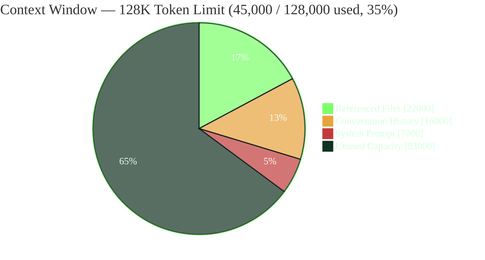
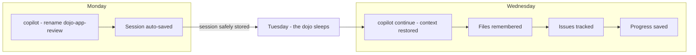
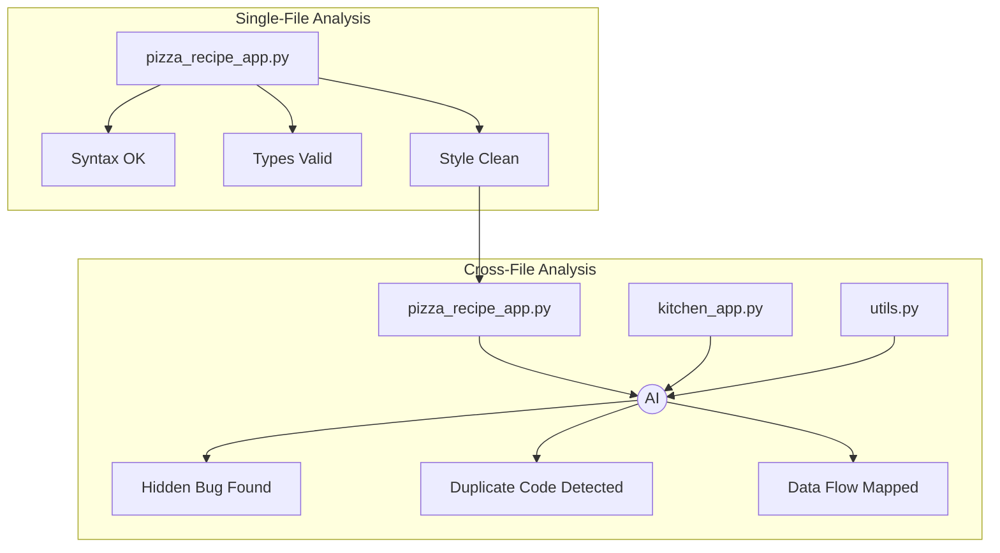
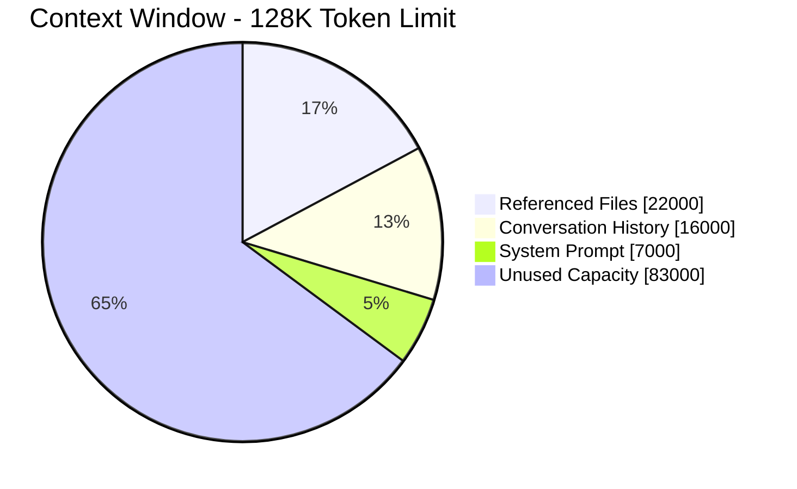

```mermaid
%%{init: {'theme':'base', 'themeVariables': {
  'primaryColor': '#123222',
  'primaryTextColor': '#f4fbf5',
  'primaryBorderColor': '#7cff6b',
  'lineColor': '#7cff6b',
  'secondaryColor': '#0a1f16',
  'secondaryTextColor': '#f4fbf5',
  'secondaryBorderColor': '#c23b3b',
  'tertiaryColor': '#0c231c',
  'tertiaryTextColor': '#f4fbf5',
  'tertiaryBorderColor': '#e8a33d',
  'background': '#03100e',
  'mainBkg': '#123222',
  'nodeTextColor': '#f4fbf5',
  'edgeLabelBackground': '#03100e',
  'fontFamily': 'Verdana'
}}}%%
flowchart TB
    subgraph Single[" 🔍 Single-File Analysis "]
        direction TB
        S1[["pizza_recipe_app.py"]]
        S1 --> SC1["✅ Syntax OK"]
        S1 --> SC2["✅ Types Valid"]
        S1 --> SC3["✅ Style Clean"]
    end

    subgraph Cross[" 🥷 Cross-File Analysis "]
        direction TB
        F1[["pizza_recipe_app.py"]]
        F2[["kitchen_app.py"]]
        F3[["utils.py"]]
        AI(("AI 🍕"))
        F1 --> AI
        F2 --> AI
        F3 --> AI
        AI --> R1["🐛 Hidden Bug Found"]
        AI --> R2["⚠️ Duplicate Code Detected"]
        AI --> R3["🔗 Data Flow Mapped"]
    end

    Single -. "misses what's only<br/>visible together" .-> Cross

    style Single fill:#0a1f16,stroke:#c23b3b,stroke-width:2px
    style Cross fill:#123222,stroke:#7cff6b,stroke-width:2px
    style AI fill:#e8a33d,stroke:#7c4a12,stroke-width:2px,color:#0a1f16
    style R1 fill:#3a1414,stroke:#e05a5a,color:#f4fbf5
    style R2 fill:#3a2c0e,stroke:#e8a33d,color:#f4fbf5
    style R3 fill:#0f2c22,stroke:#7cff6b,color:#f4fbf5
```

##

mermaid-cli is actually available — I can render these locally to verify the syntax before handing them over.Rendered successfully. Let's check it.It rendered — the pipeline works. 

Now let's build the other two.

Now the context window diagram — pie chart form.All three render cleanly with real content (varied pixel ranges, not blank canvases). Since these are meant to live inline in your README as fenced code blocks — not as standalone image files — here they are ready to paste directly:

**1. Session persistence timeline**


**2. Cross-file intelligence**



**3. Context window usage**



Two honest caveats on this approach, since it's genuinely different from the SVG route:

1. **GitHub's Mermaid renderer doesn't fully honor `themeVariables`** — flowchart node/edge colors generally come through fine, but pie-chart `pie1`–`pie4` slice coloring is inconsistently supported depending on GitHub's currently-pinned Mermaid version. If diagram 3 renders in default blue/purple instead of the dojo palette once committed, that's why — it's a GitHub limitation, not a syntax error.
2. **These are text, not art** — no turtle silhouettes or pizza icons here, just themed colors, borders, and a couple of emoji for flavor. If you want the mermaid diagrams and the illustrated SVGs sitting in the same README, they'll read as two different visual registers. Could work well as a deliberate contrast (diagrams = "reference," illustrations = "narrative"), or feel inconsistent — worth previewing both in place before committing to this for the rest of the chapters.


Good news: I found the likely culprits. GitHub runs its **own pinned build of Mermaid** (not the latest), and several things in what I gave you are known triggers for exactly this failure mode on GitHub specifically — even though they parse fine elsewhere. From digging through Mermaid's issue tracker:

1. **Colons inside bracket labels** — `Test[Phase 1: To call method]` is a documented GitHub-specific crash (mermaid-js/mermaid#5310). My diagrams had colon-free labels but let me double check — actually none of the three had this, so that's not it here, but worth knowing for future edits.
2. **The `%%{init: {...themeVariables...}}%%` block** — the most non-standard part of what I wrote. This is the prime suspect. GitHub's bundled parser has repeatedly broken on custom `themeVariables` objects that render fine on mermaid.live.
3. **`style` directives targeting subgraphs**, combined with labeled edges — another documented GitHub-specific renderer crash.

Also — GitHub actually gives you a built-in diagnostic. Drop this in a comment or the README and it'll tell you exactly which Mermaid version GitHub is running:

````
```mermaid
info
```
````

Given that, here are stripped-down versions with **no init block, no style directives** — just plain flowchart/pie syntax, which is what GitHub's own docs example uses:

**1. Session persistence timeline**


**2. Cross-file intelligence**


**3. Context window usage**


I also removed subgraph-to-subgraph edges (`Mon --> Tue`) and rewired them to connect actual leaf nodes instead (`M2 --> Tue`) — connecting subgraphs directly by name is another spot where older parsers diverge from newer ones.

If these render clean, the theming/styling was the cause, and we can add color back incrementally using `classDef` + `class` (a more universally-supported coloring mechanism than inline `style` on subgraphs) — one diagram at a time, so if something breaks again you'll know exactly which addition caused it.