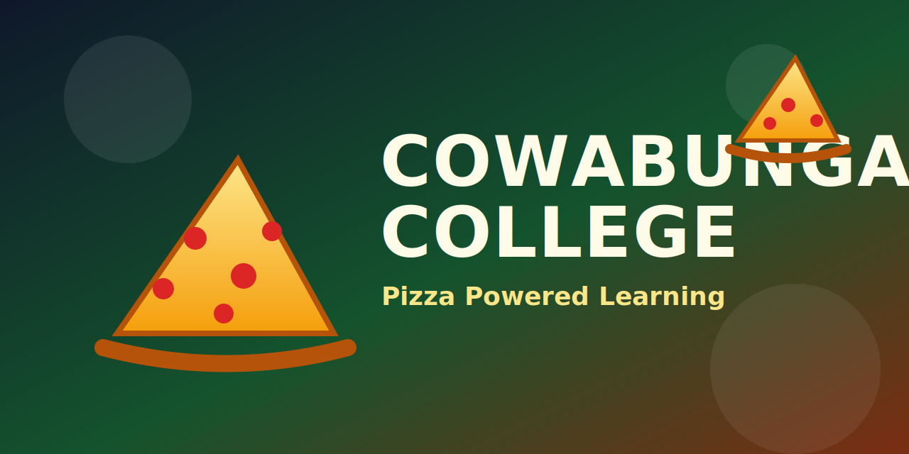

<!--
---
id: CowabungaCollege-ROOT
title: !translate Cowabunga School and College for Wayward Mutants and Cyborgs
description: !translate Pizza-powered beginner course to build agent development and operations skills with AI-assisted command-line guidance.
audience: Agent Developers / Agent Operators / Students
slug: cowabunga-college-copilot-cli
weight: 0
---
-->

&ensp;
&ensp;
&ensp;

🎯 [What You'll Learn](#what-youll-learn) &ensp; ✅ [Prerequisites](#prerequisites) &ensp; 🤖 [Copilot Family](#understanding-the-github-copilot-family) &ensp; 📚 [Course Structure](#course-structure) &ensp; 📋 [Command Reference](#-github-copilot-cli-command-reference)

# Cowabunga School and College for Wayward Mutants and Cyborgs

> **✨ Pizza-powered learning for AI-assisted agent operations in your terminal.**

Welcome to Cowabunga College, where GitHub Copilot CLI brings AI assistance directly to your terminal. Instead of switching to a browser or code editor, you can ask questions, inspect codebases, automate routine tasks, generate tests, and debug issues without leaving your command line.

Think of it as having a friendly coding sensei available 24/7 who can read your code, explain confusing patterns, and help you move faster with confidence.

> 📘 **Prefer a web experience?** You can follow this course right here on GitHub, or view it on [Awesome Copilot](https://awesome-copilot.github.com/learning-hub/cli-for-beginners/) for a more traditional browsing experience.

This pizza-fueled course is designed for:

- **Agent Developers** who want to build reliable agent-first workflows
- **Agent Operators** who run, monitor, and improve agent behavior in real environments
- **Terminal-first practitioners** who prefer keyboard-driven workflows for agent operations

## 🎯 What You'll Learn

This hands-on course takes you from zero to productive with GitHub Copilot CLI. You will train with a single Python book collection app throughout all chapters, progressively improving it using AI-assisted workflows. By the end, you will confidently use AI to review code, generate tests, debug issues, and automate workflows, all from your terminal.

**No AI experience required.** If you can use a terminal, you are ready for Cowabunga College.

**Perfect for:** Agent developers, agent operators, and students learning agent operations from the ground up.

**Important context:** This repository is not primarily a software engineering training track for developer teams. It is an agent development and agent operations learning path. The early lessons start with GitHub Copilot CLI fundamentals, then expand toward broader agent-system topics such as LLM and RAG patterns over time.

## ✅ Prerequisites

Before starting, ensure you have:

- **GitHub account**: [Create one free](https://github.com/signup) 
- **GitHub Copilot access**: [Free offering](https://github.com/features/copilot/plans), [Monthly subscription](https://github.com/features/copilot/plans), or [Free for students/teachers](https://education.github.com/pack) 
- **Terminal basics**: Comfortable with `cd`, `ls`, running commands

## 🤖 Understanding the GitHub Copilot Family

GitHub Copilot has evolved into a family of AI-powered tools. Here's where each one lives:

| Product | Where It Runs | Description |
|---------|---------------|----------|
| [**GitHub Copilot CLI**](https://docs.github.com/copilot/how-tos/copilot-cli/cli-getting-started) (this course) | Your terminal |  Terminal-native AI coding assistant  |
| [**GitHub Copilot**](https://docs.github.com/copilot) | VS Code, Visual Studio, JetBrains, etc. | Agent mode, chat, inline suggestions  |
| [**Copilot on GitHub.com**](https://github.com/copilot) | GitHub | Immersive chat about your repos, create agents, and more |
| [**GitHub Copilot cloud agent**](https://docs.github.com/copilot/using-github-copilot/using-copilot-coding-agent-to-work-on-tasks) | GitHub  | Assign issues to agents, get PRs back |

This course focuses on **GitHub Copilot CLI**, bringing AI assistance directly to your terminal.

## 📚 Course Structure

| Chapter | Title | What You'll Build |
|:-------:|-------|-------------------|
| 00 | 🚀 [Quick Start](./00-quick-start/README.md) | Installation and verification |
| 01 | 👋 [First Steps](./01-setup-and-first-steps/README.md) | Live demos + three interaction modes |
| 02 | 🔍 [Context and Conversations](./02-context-conversations/README.md) | Multi-file project analysis |
| 03 | ⚡ [Development Workflows](./03-development-workflows/README.md) | Code review, debug, test generation |
| 04 | 🤖 [Create Specialized AI Assistants](./04-agents-custom-instructions/README.md) | Custom agents for your workflow |
| 05 | 🛠️ [Automate Repetitive Tasks](./05-skills/README.md) | Skills that load automatically |
| 06 | 🔌 [Connect to GitHub, Databases & APIs](./06-mcp-servers/README.md) | MCP server integration |
| 07 | 🎯 [Putting It All Together](./07-putting-it-together/README.md) | Complete feature workflows |

## 📖 How This Course Works

Each chapter follows the same beginner-friendly training pattern:

1. **Real-World Analogy**: Understand the concept through familiar comparisons
2. **Core Concepts**: Learn the essential knowledge
3. **Hands-On Examples**: Run actual commands and see results
4. **Assignment**: Practice what you learned
5. **What's Next**: Preview of the following chapter

**Code examples are runnable.** Every command block in this course is copy-paste ready. When you see a `copilot` prompt, run it exactly as shown in your terminal session.

## 📋 GitHub Copilot CLI Command Reference

Need a quick move list before your next coding sparring session? The **[GitHub Copilot CLI command reference](https://docs.github.com/en/copilot/reference/cli-command-reference)** helps you find commands and keyboard shortcuts to use Copilot CLI effectively.

## 🙋 Getting Help

Need backup from the dojo support crew?

- 🐛 **Found a bug in the training grounds?** [Open an Issue](https://github.com/breconno/cowabunga/issues)
- 📚 **Need official guidance?** [GitHub Copilot CLI Documentation](https://docs.github.com/copilot/concepts/agents/about-copilot-cli)

## Contributing

> **Dojo Rule**: The code used in this course is intentionally designed to produce specific outputs during reviews, explanations, and debugging. To keep lessons consistent for all learners, we cannot accept PRs that change the existing sample code.

**How to contribute to Cowabunga College:**

1. Fork this repository and clone it to your machine
2. Create a feature branch (`git checkout -b my-improvement`)
3. Make your changes
4. Submit a pull request

## License

This project is licensed under the MIT open source license. See the [LICENSE](./LICENSE) file for full details.
